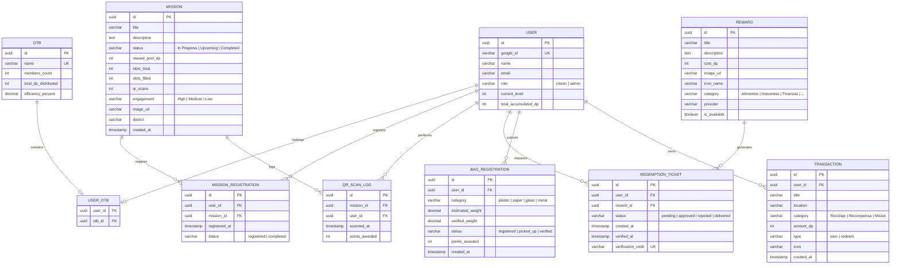

# Especificación Técnica y Funcional: Sistema de Administración (Sentinel-CBBA)
## Eco-Llajta - Gestión de Impacto Ecológico y Comunidad

Este documento detalla la especificación del sistema de administración (**Sentinel-CBBA**), diseñado en completa consonancia con la estructura actual del Frontend de Angular (`app.routes.ts`, componentes, modelos de dominio, DTOs y lógica de estados). Su propósito es servir de puente exacto y vinculante para la creación del **Backend (REST API)** y el diseño de la **Base de Datos relacional (DB)**.

---

## 1. Alineación Arquitectónica y Terminología Clave

Para garantizar una integración libre de fricciones, el Backend y la DB deben respetar la terminología y tipos de datos ya definidos en el frontend:

*   **Puntos de Recompensa (Dirty Points / DP):** Toda la economía del sistema se rige bajo el concepto de **Dirty Points (DP)**, acumulados al reciclar o completar misiones, y descontados al canjear recompensas.
*   **OTB (Organización Territorial de Base):** En Cochabamba, la competencia comunitaria se mide a través del rendimiento agregado de las OTBs (ej. *OTB Sarco*, *OTB Queru Queru*).
*   **Sentinel-CBBA:** Nombre oficial de la consola de administración municipal.
*   **Roles de Usuario:** Soportado en `user.state.ts`, los roles válidos son `'citizen' | 'admin'`. El flujo de administración está protegido por el guard `adminAuthGuard`.

---

## 2. Estructura de Datos y Modelos (Entidades y DTOs)

A continuación, se especifican las estructuras exactas mapeadas a partir de la implementación del frontend.

### 2.1 Módulo de Misiones Comunitarias

#### MissionEntity / MissionDto (`mission.entity.ts` y `mission.dto.ts`)
Representa una actividad de voluntariado ambiental en un distrito de Cochabamba.

| Campo | Tipo Frontend | Tipo DB (Sugerido) | Descripción |
| :--- | :--- | :--- | :--- |
| `id` | `string` | `UUID / VARCHAR(36)` | Identificador único de la misión (Primary Key). |
| `title` | `string` | `VARCHAR(100)` | Título descriptivo (ej. "Reforestación Parque Sur"). |
| `description` | `string` | `TEXT` | Detalles y objetivos de la misión. |
| `status` | `'In Progress' \| 'Upcoming' \| 'Completed'` | `VARCHAR(20)` | Estado actual de ejecución de la misión. |
| `rewardPoolDirtyPoints`| `number` | `INT` | Total de Dirty Points (DP) destinados a la recompensa de esta misión. |
| `slotsTotal` | `number` | `INT` | Cupo total de voluntarios admitidos. |
| `slotsFilled` | `number` | `INT` | Cupo de voluntarios registrados actualmente. |
| `qrScans` | `number` | `INT` | Número de escaneos QR realizados y validados en campo. |
| `engagement` | `'High' \| 'Medium' \| 'Low'` | `VARCHAR(10)` | Nivel de participación / interacción estimado. |
| `imageUrl` | `string` | `VARCHAR(255)` | URL de la imagen de portada de la misión. |
| `district` | `string` | `VARCHAR(50)` | Distrito / Comuna municipal donde ocurre (ej. "Distrito 4"). |
| `createdAt` | `Date / string` | `TIMESTAMP` | Fecha de creación del registro. |

---

### 2.2 Módulo de Recompensas y Canjes

#### RewardEntity / RewardDto (`reward.entity.ts` y `reward.dto.ts`)
Artículos, cupones o beneficios fiscales que el ciudadano puede canjear utilizando sus DP.

| Campo | Tipo Frontend | Tipo DB (Sugerido) | Descripción |
| :--- | :--- | :--- | :--- |
| `id` | `string` | `UUID / VARCHAR(36)` | Identificador único de la recompensa (PK). |
| `title` / `name` | `string` | `VARCHAR(100)` | Nombre de la recompensa (ej. "Canasta de Alimentos (EMAPA)"). |
| `description` | `string` | `TEXT` | Términos, condiciones y detalles del beneficio. |
| `costDp` / `pointCost` | `number` | `INT` | Costo en Dirty Points requerido para el canje. |
| `imageUrl` | `string` | `VARCHAR(255)` | URL de la imagen del producto/servicio. |
| `icon` / `iconName` | `string` | `VARCHAR(50)` | Icono de Google Material Symbols (ej. `shopping_basket`). |
| `category` | `RewardCategory` | `VARCHAR(30)` | Categorías válidas: `'Alimentos' \| 'Impuestos' \| 'Finanzas' \| 'Transporte' \| 'Salud' \| 'Educación' \| 'Otro'`. |
| `provider` | `string` | `VARCHAR(100)` | Entidad proveedora (ej. "EMAPA", "Municipio de Cochabamba"). |
| `isAvailable` / `available`| `boolean` | `BOOLEAN` | Indica si el producto cuenta con stock disponible. |

#### TransactionEntity / TransactionDto (`reward.entity.ts` y `reward.dto.ts`)
Registro histórico de movimientos financieros de DP de un ciudadano.

| Campo | Tipo Frontend | Tipo DB (Sugerido) | Descripción |
| :--- | :--- | :--- | :--- |
| `id` | `string` | `UUID / VARCHAR(36)` | Identificador de transacción (PK). |
| `title` / `description` | `string` | `VARCHAR(150)` | Concepto de la transacción (ej. "PET recycling"). |
| `location` | `string` | `VARCHAR(100)` | Punto físico o canal donde ocurrió (ej. "Centro de Acopio Sur"). |
| `category` | `string` | `VARCHAR(50)` | Categorías: `'Reciclaje' \| 'Recompensa' \| 'Misión'`. |
| `date` / `createdAt` | `string (ISO)` | `TIMESTAMP` | Fecha y hora de la transacción. |
| `amountDp` / `points` | `number` | `INT` | Puntos del movimiento. Positivo = ganancia (`earn`), Negativo = canje (`redeem`). |
| `icon` | `string` | `VARCHAR(50)` | Icono visual asignado (ej. `'recycling'`, `'shopping_cart'`). |

---

### 2.3 Módulo de Reciclaje y Bolsas Ecológicas

#### BagRegistration (Mapeado de `register-bag.ts` y `my-recycling.html`)
Registros de bolsas ecológicas que los ciudadanos entregan para sumar DP.

| Campo | Tipo Frontend | Tipo DB (Sugerido) | Descripción |
| :--- | :--- | :--- | :--- |
| `id` | `string` | `UUID / VARCHAR(36)` | Identificador único de la bolsa registrada. |
| `userId` | `string` | `UUID / VARCHAR(36)` | Relación con el ciudadano que registró la bolsa (FK). |
| `category` | `'plastic' \| 'paper' \| 'glass' \| 'metal'` | `VARCHAR(20)` | Categoría del material reciclable seleccionado en el paso 1. |
| `weight` | `number` | `DECIMAL(5,2)` | Peso estimado en kilogramos ingresado por el ciudadano o pesado en báscula. |
| `pointsAwarded` | `number` | `INT` | Cantidad de Dirty Points calculada y asignada. |
| `status` | `'registered' \| 'picked_up' \| 'verified'`| `VARCHAR(20)` | Ciclo de vida del recojo (Registrado, Recogido por chofer, Verificado en planta). |
| `location` | `string` | `VARCHAR(150)` | Dirección o Punto Verde de entrega (ej. "Punto Verde Cala Cala"). |
| `createdAt` | `string` | `TIMESTAMP` | Fecha de registro de la bolsa. |

---

## 3. Especificación de Pantallas y Casos de Uso del Admin

El Shell de Sentinel-CBBA (`admin-layout.component.html`) define un menú lateral persistente con acceso a 4 grandes áreas de gestión:
1.  **Dashboard de Control Municipal**
2.  **Gestión de Misiones (`/admin/missions`)**
3.  **Logística y Recojos (`/admin/logistics`)**
4.  **Gestión de Usuarios y OTBs (`/admin/users`)**

A continuación, detallamos cada flujo técnico y su correspondencia.

---

### 3.1 MÓDULO 1: Gestión de Misiones Comunitarias (Pantallas Implementadas)

Este módulo ya cuenta con soporte visual robusto en Angular. El Backend y la DB deben proveer los endpoints y persistencia para habilitarlo al 100%.

#### Pantalla A: Panel de Control de Misiones (`/admin/missions`)
*   **Propósito:** Visualizar métricas críticas globales, listar misiones creadas con barra de progreso de cupos y ver el ranking de OTBs.
*   **Elementos Visuales Clave (en el HTML):**
    *   **KPIs en Tarjetas superiores:**
        *   *Total Rewards Distributed:* Sumatoria global de DP distribuidos en misiones (ej. `142,500 DP`).
        *   *Active Missions:* Conteo de misiones con estado `'In Progress'`.
        *   *Active Volunteers:* Conteo total de usuarios registrados en misiones activas.
        *   *QR Verification Rate:* Porcentaje global de escaneos QR validados con éxito respecto a los intentos.
    *   **Lista de Misiones:** Tarjetas individuales con imagen de portada, título, descripción, `district`, etiqueta de estado con color personalizado (`statusColor`), y relación de slots ocupados (`slotsFilled / slotsTotal`).
    *   **Panel Lateral (OTB Rankings):** Tabla que muestra el ranking de las OTBs del municipio en base a los DP acumulados (`dirtyPointsDistributed`) y su porcentaje de eficiencia.
    *   **Modal "Create New Mission":** Formulario interactivo para lanzar misiones en tiempo real.
*   **Estructura de Datos del Endpoint (`AdminMissionsPageDto`):**
    ```typescript
    export interface AdminMissionsPageDto {
      totalDirtyPointsDistributed: number;
      activeMissionsCount: number;
      activeVolunteers: number;
      qrVerificationRate: number;
      missions: MissionDto[];
      otbRankings: OtbRankingDto[];
    }
    ```

#### Pantalla B: Detalle e Indicadores de Misión (`/admin/missions/:id`)
*   **Propósito:** Auditar el rendimiento de una misión específica, verificar escaneos en tiempo real, visualizar línea de tiempo y tomar acciones administrativas.
*   **Elementos Visuales Clave:**
    *   **Encabezado Hero:** Imagen gigante, distrito, y badge de estado.
    *   **Tarjetas KPI específicas:** Reward Pool individual, Slots Completados, Escaneos de códigos QR validados, y nivel de Engagement calculado.
    *   **Barra de Progreso Dinámica:** Cambia de color según el llenado (Rojo < 40%, Naranja < 75%, Verde > 75%).
    *   **Panel Lateral "Recent QR Activity":** Log en tiempo real de los voluntarios escaneando sus códigos QR para reclamar puntos en campo (ej. *"Volunteer #1002 - hace 12 min - +15 DP"*).
    *   **Acciones Administrativas:** Botones para **Editar datos de la misión** (`Edit Mission`) y **Pausar/Suspender la misión** (`Pause Mission`).

---

### 3.2 MÓDULO 2: Gestión de Logística y Recojos (`/admin/logistics` - Pendiente de maquetación en Frontend)

Diseñado para los recolectores municipales y operarios de plantas de transferencia.

*   **Propósito:** Monitorear solicitudes de recojo domiciliario, validar bolsas entregadas y ajustar el peso verificado para asignar los DP correspondientes.
*   **Pantallas requeridas para el Administrador de Logística:**
    1.  **Bandeja de Solicitudes Pendientes:** Listado de recojos solicitados por los ciudadanos tras usar el botón "Solicitar Recojo" (`register-bag.html`). Debe mostrar dirección, nombre del ciudadano, categoría del material y peso estimado.
    2.  **Hoja de Ruta del Conductor:** Pantalla móvil-responsiva para choferes de camiones recolectores con geolocalización de las bolsas pendientes y botón para cambiar estado a `'picked_up'`.
    3.  **Consola de Pesaje y Verificación:** Panel donde el administrador de la planta de reciclaje confirma la recepción física del material, ingresa el **Peso Real Verificado**, y el sistema gatilla automáticamente la transacción de DP a la billetera del ciudadano.

---

### 3.3 MÓDULO 3: Gestión de Recompensas y Canjes (Centro de Comunidad / Beneficios)

Alineado con el flujo de canje de los usuarios (`rewards.html`).

*   **Propósito:** Administrar el catálogo de beneficios disponibles en Cochabamba y procesar las solicitudes de canje de los ciudadanos.
*   **Pantallas requeridas para el Administrador:**
    1.  **Administrador de Catálogo:** Formulario para subir nuevas recompensas, cargar la imagen, definir el costo en Dirty Points, clasificar la categoría (ej. *Impuestos*) y seleccionar el proveedor asociado (ej. *EMAPA*).
    2.  **Panel de Auditoría de Transacciones:** Registro completo de egresos e ingresos de DP. Permite auditar el estado del canje (`redemptionStatus`): `'pending' | 'approved' | 'rejected' | 'delivered'`.
    3.  **Bandeja de Validación de Ticket:** Cuando un ciudadano canjea una recompensa en el frontend (`redeem-ticket.html`), se genera un ticket único con código QR. El Admin municipal o el representante del proveedor (ej. cajero de EMAPA) debe poder escanear dicho QR para validar el ticket y marcarlo como `delivered` en la base de datos, evitando canjes duplicados.

---

### 3.4 MÓDULO 4: Gestión de Usuarios e Impacto Global (`/admin/users`)

*   **Propósito:** Administrar las cuentas del sistema, gestionar roles y auditar comportamientos.
*   **Pantallas requeridas para el Administrador:**
    1.  **Listado de Usuarios:** Tabla interactiva con búsqueda por nombre, CI/Google ID, OTB de residencia, Rango ecológico, acumulado histórico de DP, y racha de días activos.
    2.  **Detalle del Ciudadano:** Ficha técnica con su historial de transacciones (Bolsas entregadas, misiones atendidas, cupones canjeados).
    3.  **Gestión de Roles:** Permite promover a un usuario de `'citizen'` a `'admin'` para autorizar el acceso a Sentinel-CBBA.

---

## 4. Contrato de la API REST (Endpoints del Backend Requeridos)

Para implementar el backend de forma 100% consistente con los servicios de Angular (`http-reward.repository.ts` y los casos de uso correspondientes), se deben levantar los siguientes endpoints:

### 4.1 Misiones (`/api/missions`)
*   `GET /api/missions`: Retorna el objeto `AdminMissionsPageDto` con el consolidado de estadísticas, listado completo de misiones y ranking de OTBs.
*   `GET /api/missions/{id}`: Retorna el detalle detallado de una misión por ID (`MissionDto`).
*   `POST /api/missions`: Recibe un cuerpo JSON tipo `CreateMissionFormDto` para persistir una nueva misión (por defecto se crea en estado `'Upcoming'`).
*   `PUT /api/missions/{id}`: Actualiza los campos modificables de una misión.
*   `POST /api/missions/{id}/pause`: Alterna o fuerza el estado de la misión a pausa administrativa.

### 4.2 Recompensas y Canjes (`/api/rewards`)
*   `GET /api/rewards`: Retorna el catálogo completo de recompensas (`RewardDto[]`) para desplegar en el panel del ciudadano.
*   `POST /api/rewards`: Crea una nueva opción de recompensa para el catálogo municipal.
*   `PUT /api/rewards/{id}`: Actualiza stock, disponibilidad, costo o datos del proveedor.
*   `GET /api/rewards/wallet`: Retorna el estado financiero del usuario autenticado (`WalletDto`), incluyendo saldo de puntos, nivel eco-héroe y log de transacciones.
*   `POST /api/rewards/redeem`: Recibe `{ rewardId }`. Valida si el usuario tiene suficientes DP en su wallet. Resta los puntos, registra la transacción con signo negativo, crea el ticket de redención en estado `'pending'` y retorna `{ redemptionId, newBalance }`.
*   `POST /api/rewards/redemptions/{id}/verify`: Escanea y marca un ticket como `'delivered'` (ejecutado por el proveedor).

### 4.3 Logística y Bolsas (`/api/recycling`)
*   `POST /api/recycling/bag`: El ciudadano registra y solicita el recojo de una bolsa (`plastic`, `paper`, `glass` o `metal`) enviando peso estimado y ubicación.
*   `GET /api/recycling/pending`: Obtiene la lista de bolsas en estado `'registered'` o `'picked_up'` para planeación logística.
*   `PUT /api/recycling/verify/{bagId}`: Recibe `{ verifiedWeight }`. Modifica el estado a `'verified'`, calcula los DP en base al tipo de material y peso real, y abona el saldo a la wallet del usuario, registrando la transacción como `'earn'`.

---

## 5. Diseño Sugerido de Base de Datos (Modelo Entidad-Relación)

Para soportar de manera óptima las misiones, el canje de recompensas y la logística de reciclaje descritos en los DTOs, se propone el siguiente diseño relacional:



---

## 6. Plan de Sincronización e Implementación Paso a Paso

Para lograr que el Frontend existente interactúe sin problemas con este Backend y Base de Datos, se recomienda seguir esta ruta secuencial:

### Paso 1: Configurar la Capa de Datos Real en Frontend
Reemplazar los repositorios Mock en Angular por clientes HTTP que apunten a los endpoints de la sección 4:
*   Migrar `mock-mission.repository.ts` a un servicio HTTP similar a `http-reward.repository.ts`.
*   Asegurar que los interceptores de Angular adjunten el Token de autenticación del usuario (ej. JWT generado tras el inicio de sesión con Google) en cada llamada HTTP.

### Paso 2: Crear el Servidor API REST (Backend)
*   Configurar un framework robusto y escalable (ej. NestJS con TypeScript, Spring Boot con Java, o Express con Node.js).
*   Implementar la capa de autenticación validando los tokens de Google OAuth directamente contra el SDK de Google, mapeándolos a la tabla de usuarios local y determinando su rol (`citizen` o `admin`).

### Paso 3: Estructurar la Base de Datos
*   Aplicar scripts de migración (ej. Liquibase, Flyway o TypeORM migrations) para generar el esquema ER ilustrado en la sección 5.
*   Poblar datos iniciales (*Seeders*): Cargar categorías de recompensas estándar, OTBs del municipio de Cochabamba, y algunas misiones semilla.

### Paso 4: Validaciones y Pruebas Cruzadas
*   **Prueba de Roles:** Verificar que un usuario sin rol `admin` sea redirigido al dashboard de ciudadanos al intentar entrar en `/admin/*` usando el `adminAuthGuard`.
*   **Prueba de Canjes:** Ejecutar un flujo de canje en el portal ciudadano, verificar que se reste el saldo en tiempo real, se genere la transacción negativa y el ticket aparezca en Sentinel como `pending`. Luego, validar el ticket en Sentinel y verificar que pase a `delivered`.
*   **Prueba de Escaneo QR:** Simular un registro de voluntario en una misión, escanear el QR y verificar que la cuenta de `qrScans` y los puntos `slotsFilled` aumenten dinámicamente en Sentinel-CBBA.
